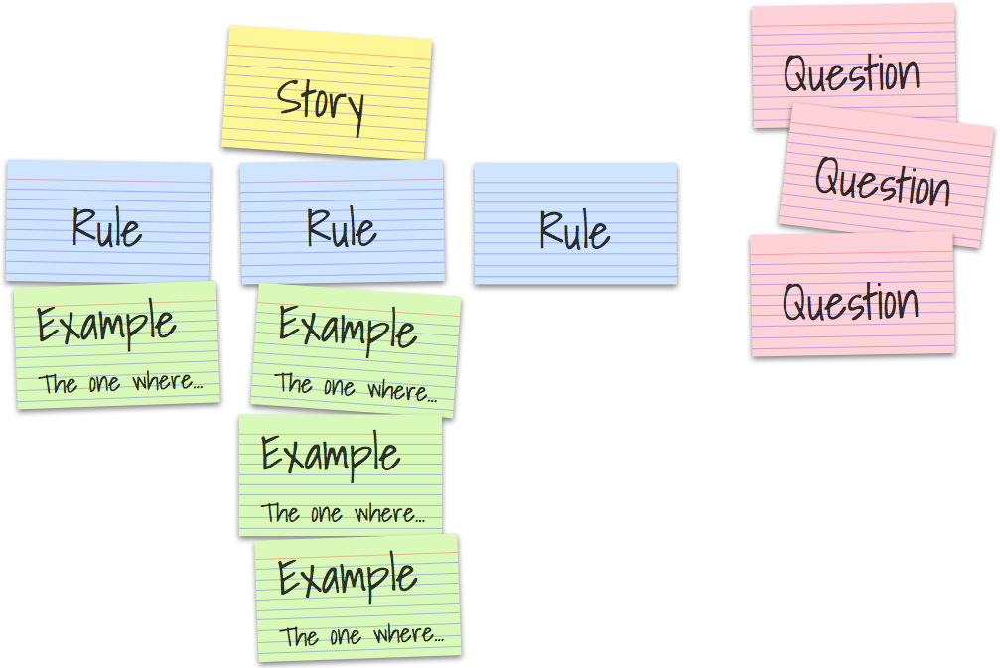
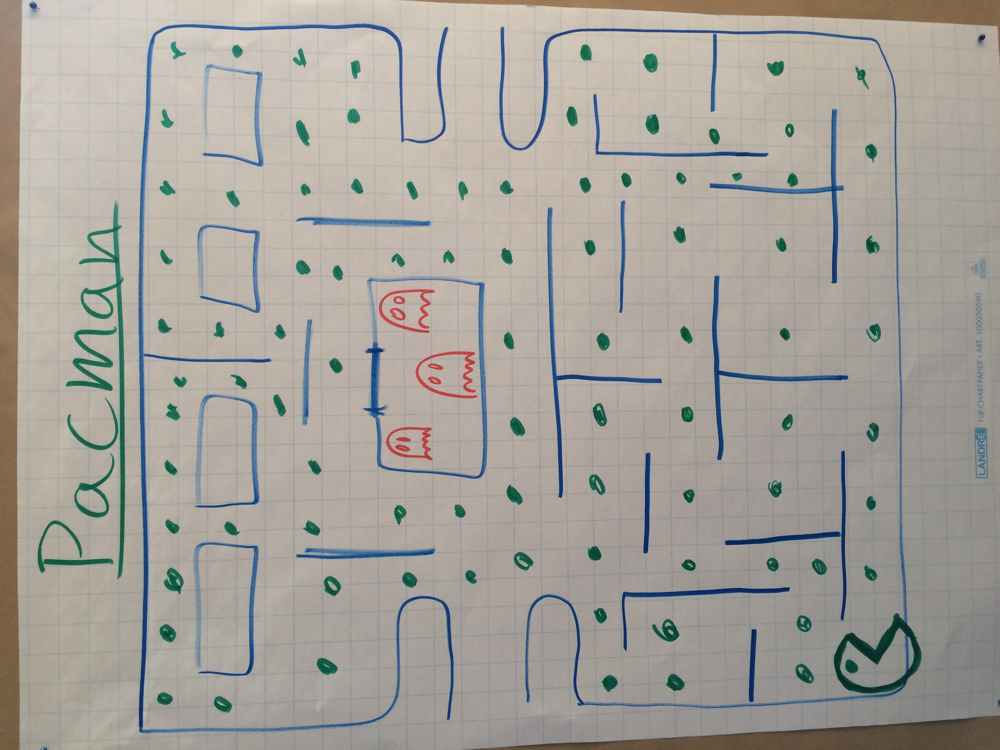
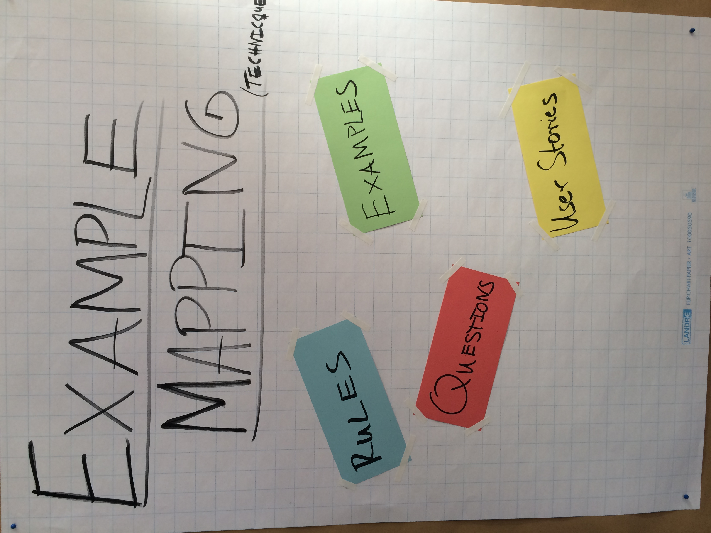
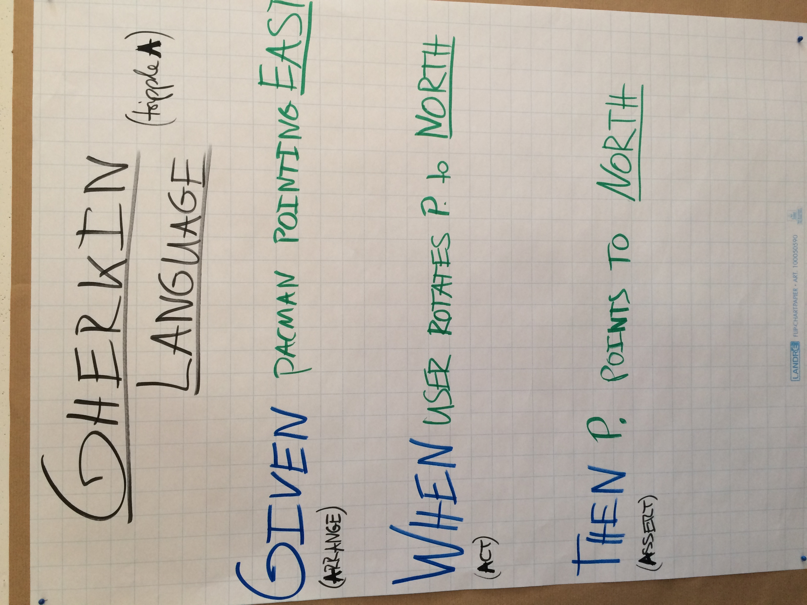
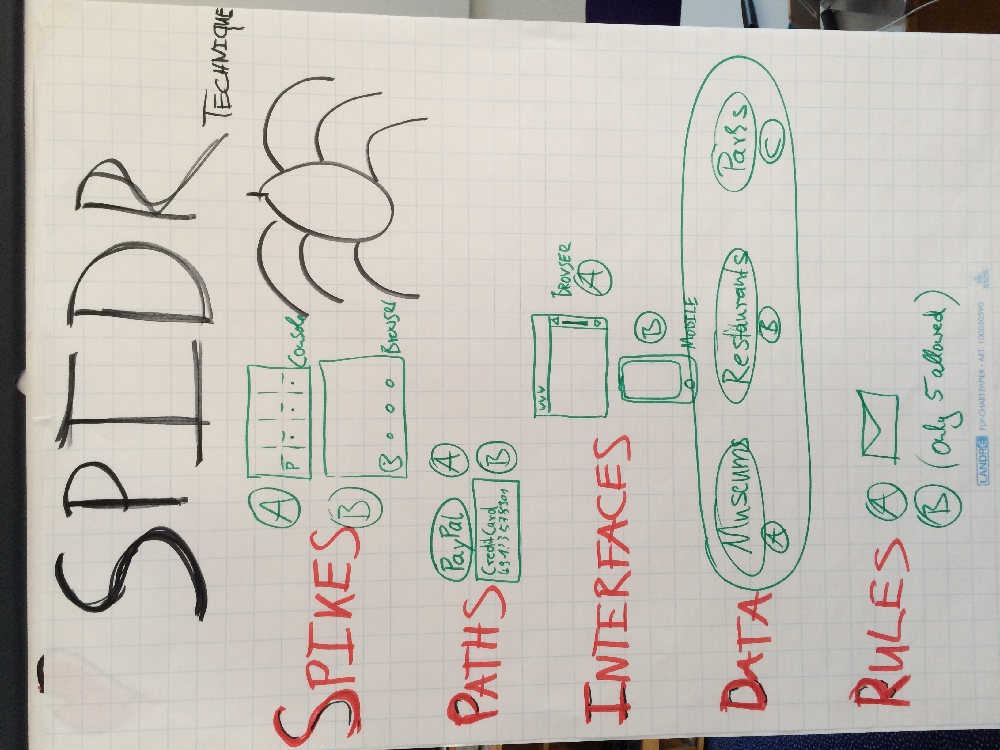
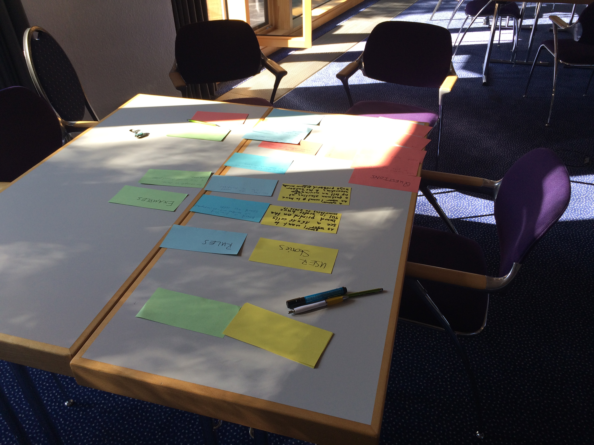
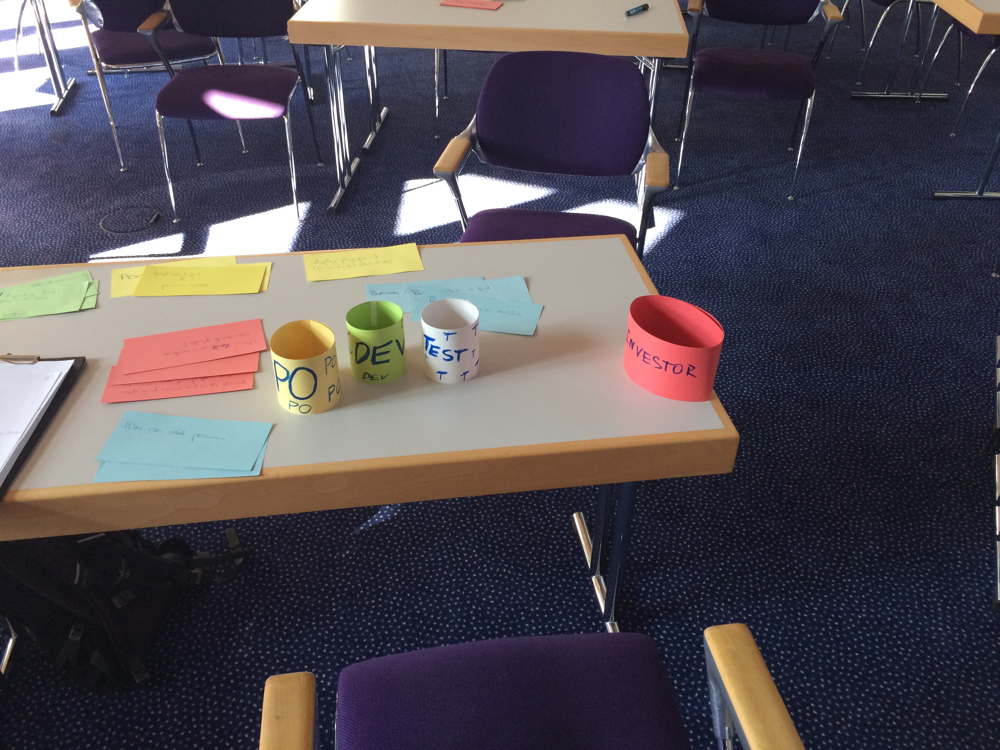

# Summary Socrates Conference 2019 Soltau

# Session 1: Acceptace Tests
Pitch at the Market Space:
Who has real world experience regarding Acceptance Tests that are written in Gherkin (Given, When, Then).
* What are your challenges? 
* What did you learn in real world projects?
* How did it impact Quality and Communication?

Session Outline:
1) Introduction to Gherkin Language with simple example written in Python (using `behave`)
2) Open Discussion: What are your experiences?

## Open Discussion Notes

key words:
* ATDD
* BDD
* Cucumber
* Gherkin
* living documentation
* specification by example
* example guided design

tools used by the industry:
* FitNesse
* Robot-Framework
* Cucumber (FlowSpec (C#), behave (python))
* Plugins:
    * LivingDoc (Confluence)
    * SpecFlow+ LivingDoc (VSTS)

https://jp-lambert.me/comparing-executable-specification-tools-b7081cc26315

Goals:
* improve communication, collaboration, feature discovery
* bring business people closer together with technical people

Important Figures: 

**Kent Beck**
> Stop exchanging documents. Tell me your story. If we could just talk about this, we could figure it out together.

**Ash Winter**
> We often talk about how testing is for the whole team. Quality is everyone’s responsibility. How much are we really doing to make this happen? Often, we are working on systems that are hard to test for many reasons, but if we simply do more testing, write more automation we are neglecting what should be our main mission, advocating for increasing levels of testability, to truly get everyone involved in testing. 

related concepts and techniques:
* Impact Mapping
* Story Mapping
* Example Mapping

# Session 2: Example Mapping

**Introduction**

Example Mappings are workshops that help teams to create well defined user stories (small, specific). Example Mapping acts like a filter, preventing big fat stories from getting into your sprint and exploding with last-minute surprises three days before demo-day.

Alternative names for Example Mapping:
* discovery workshop
* specification workshop
* conversation to clarify acceptance criteria workshop

**Benefits**

Example Mapping helps you zoom in and focus on the smallest pieces of behaviour inside your story:
* tease appart the rules
* find the core of the behaviour you want
* defer the rest until later

**Koncept**

Example Mapping uses a pack of 4-coloured index cards and some pens to capture these different types of information as the conversation unfolds. As we talk, we capture them on index cards, and arrange them in a map:

* Rules (blue)
* Questions (red)
* Examples (green)
* User Stories (yellow)

We start by writing the story under discussion on a yellow card and placing it at the top of the table.

Next we write each of the acceptance criteria, or rules that we already know, on a blue card and placing those across the table beneath the yellow story card.

For each rule, we may need one or more examples to illustrate it. We write those on a green card and place them under the relevant rule.

As we discuss these examples, we may uncover questions that nobody in the room can answer. We capture those on a red card and move on with the conversation.

The groups mission is to define a clear scope of the user story and defer tasks that are out of scope into new user stories. We write those on a yellow card. The group may also discover new user stories or slice down a big user story into smaller ones.

And that’s it. It is simple!

**Who should come?**

three amigos:
* PO - Product Owner
* DEV - Developer
* TEST - Tester

**How often should we do this?**

Every other day is often a good rhythm. Just pick one story and give it 25 minutes of attention, then go back to work. Trying to do more in a big batch will just drain your energy.

source:
https://cucumber.io/blog/example-mapping-introduction/

**Impressions of the Workshop**

